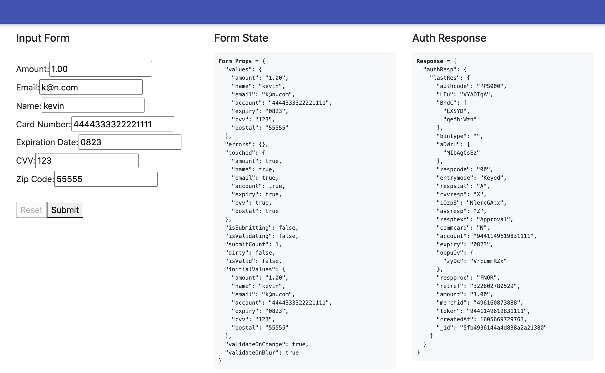
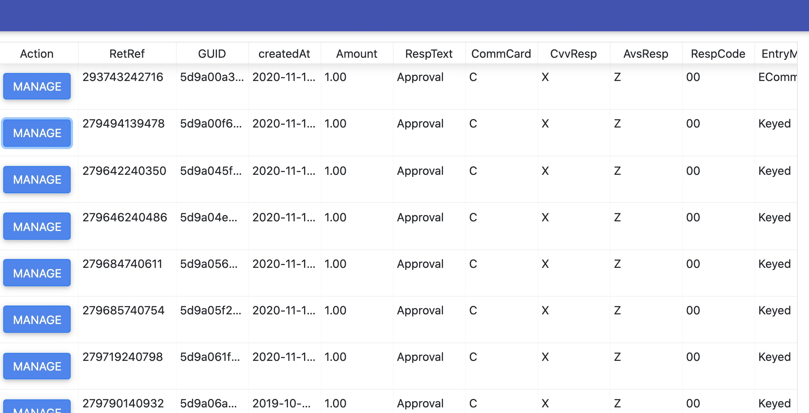
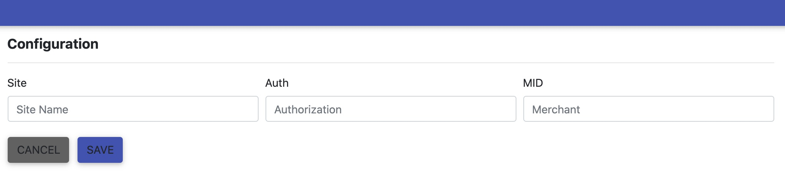

# CardConnect MERN App (WIP)
Example/practice for MERN implementation of CardConnect's Payment APIs.

## Dependencies
Create local payments mongo database and an 'auths' collection. 
- seed: `server/scripts/authDB.js`

## Usage
```
1. git clone https://github.com/kevnat/cardconnect-react.git
2. setup/start database 
3. npm install
4. cd server && npm start
5. cd client && npm start
```

## Screenshots
#### Pay Form


#### Transaction Report 


#### Config Form


## Overview
see [wiki](https://github.com/kevnat/cardconnect-react/wiki)